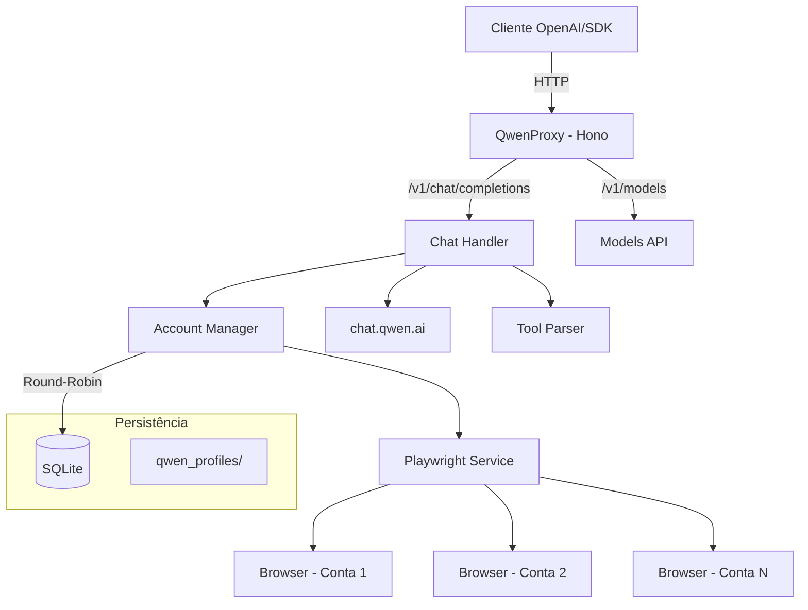

# QwenProxy

Proxy API local compatível com OpenAI que roteia requisições para os modelos do **Qwen (chat.qwen.ai)** via automação de navegador com Playwright. Suporte a múltiplas contas com rotação automática, execução de ferramentas, modo de pensamento (reasoning), persistência de sessão e armazenamento em SQLite.

[](https://github.com/pedrofariasx/qwenproxy/actions/workflows/ci.yml)
[](https://www.typescriptlang.org/)
[](https://hono.dev/)
[](https://playwright.dev/)
[](LICENSE)

---

## Features

- **OpenAI API Compatible** — Interface compatível com `/v1/chat/completions` e `/v1/models`.
- **Multi-Account** — Gerencie múltiplas contas Qwen com rotação round-robin e cooldown automático.
- **SQLite Storage** — Contas salvas em banco de dados SQLite (WAL mode) para performance e confiabilidade.
- **Reasoning Support** — Suporte completo ao modo de pensamento (thinking) dos modelos Qwen.
- **Tool Execution** — Sistema de execução de ferramentas locais integrado ao fluxo do chat.
- **Session Persistence** — Perfil de navegador persistente por conta em `qwen_profiles/`.
- **Auto-Login** — Login automático via credenciais com recuperação de sessão.
- **Browser Selection** — Escolha entre Chromium, Chrome, Firefox, Edge ou WebKit.
- **Monitoring** — Health check, métricas Prometheus e watchdog integrados.
- **Docker Ready** — Deploy para VPS com Docker, volumes persistentes e graceful shutdown.

---

## Arquitetura



---

## Pré-requisitos

| Dependência | Versão Mínima | Instalação |
|------------|--------------|-----------|
| Node.js | v20.x | [nvm](https://github.com/nvm-sh/nvm) |
| npm | v9.x | Incluído com Node.js |
| Playwright | - | `npx playwright install` |
| Docker (opcional) | v24.x | [Docker Docs](https://docs.docker.com/get-docker/) |

---

## Instalação

### Via npm

```bash
git clone https://github.com/pedrofariasx/qwenproxy.git
cd qwenproxy
npm install
npx playwright install
```

### Via Docker

```bash
docker-compose up -d
```

---

## Configuração

Crie o arquivo `.env` na raiz do projeto (veja `.env.example`):

```env
# Porta do servidor (default: 3000)
PORT=3000

# Chave de API para proteger os endpoints (opcional)
API_KEY=sua-chave-secreta-aqui

# Credenciais Qwen para login automático (modo single-account)
QWEN_EMAIL=seu-email@exemplo.com
QWEN_PASSWORD=sua-senha-aqui

# Navegador (chromium, firefox, chrome, edge)
BROWSER=chromium
```

---

## Gerenciamento de Contas

As contas são armazenadas em SQLite (`data/qwenproxy.db`). Use o CLI interativo para gerenciar:

```bash
# Abrir o gerenciador de contas
npm run login

# Com navegador específico
npm run login:firefox
npm run login:chrome
npm run login:edge
```

O menu interativo permite:
- **[A]** Adicionar conta com credenciais (email + senha)
- **[M]** Adicionar conta via login manual no navegador
- **[R]** Remover uma conta
- **[L]** Login em todas as contas (inicializar sessões)

> Na primeira execução, se existir um `accounts.json` antigo, as contas serão migradas automaticamente para SQLite.

---

## Uso

### Iniciar o servidor

```bash
npm start                  # Chromium (padrão)
npm run start:chrome       # Google Chrome
npm run start:firefox      # Firefox
npm run start:edge         # Microsoft Edge
```

O servidor inicia em `http://localhost:3000` com as seguintes rotas:

| Rota | Método | Descrição |
|------|--------|-----------|
| `/v1/chat/completions` | POST | Chat completions (streaming + non-streaming) |
| `/v1/chat/completions/stop` | POST | Abortar uma geração ativa |
| `/v1/models` | GET | Listar modelos disponíveis |
| `/v1/models/:model` | GET | Informações de um modelo específico |
| `/health` | GET | Health check com status do sistema |
| `/metrics` | GET | Métricas no formato Prometheus |

---

## Exemplos de Integração

### OpenAI SDK (Node.js)

```typescript
import OpenAI from 'openai';

const openai = new OpenAI({
  baseURL: 'http://localhost:3000/v1',
  apiKey: process.env.API_KEY || 'sk-no-key-required'
});

const completion = await openai.chat.completions.create({
  model: 'qwen-plus',
  messages: [{ role: 'user', content: 'Explique como funciona o Playwright.' }]
});

console.log(completion.choices[0].message.content);
```

### cURL

```bash
curl http://localhost:3000/v1/chat/completions \
  -H "Content-Type: application/json" \
  -H "Authorization: Bearer sua-chave" \
  -d '{
    "model": "qwen-plus",
    "messages": [{"role": "user", "content": "Hello!"}],
    "stream": true
  }'
```

---

## Deploy com Docker

### docker-compose.yml

```yaml
services:
  qwenproxy:
    build: .
    container_name: qwenproxy
    ports:
      - "${PORT:-3000}:3000"
    env_file:
      - .env
    volumes:
      - ./data:/app/data               # Banco SQLite
      - ./qwen_profiles:/app/qwen_profiles  # Sessões dos navegadores
    restart: unless-stopped
```

### Volumes persistentes

| Volume | Conteúdo |
|--------|----------|
| `./data` | Banco SQLite com as contas (`qwenproxy.db`) |
| `./qwen_profiles` | Perfis de navegador por conta (cookies, sessões) |

---

## Estrutura do Projeto

```
qwenproxy/
├── src/
│   ├── index.ts                 # Entry point
│   ├── login.ts                 # CLI de gerenciamento de contas
│   ├── api/
│   │   ├── models.ts            # Endpoints /v1/models
│   │   └── server.ts            # Servidor Hono + startup
│   ├── cache/
│   │   └── memory-cache.ts      # Cache em memória com TTL
│   ├── core/
│   │   ├── account-manager.ts   # Rotação round-robin + cooldowns
│   │   ├── accounts.ts          # CRUD de contas (SQLite)
│   │   ├── config.ts            # Configuração com Zod
│   │   ├── database.ts          # Conexão e migrations SQLite
│   │   ├── logger.ts            # Logger estruturado
│   │   ├── metrics.ts           # Coleta de métricas
│   │   ├── model-registry.ts    # Registro de modelos e context windows
│   │   ├── stream-registry.ts   # Tracking de streams ativos
│   │   └── watchdog.ts          # Health monitoring
│   ├── routes/
│   │   ├── chat.ts              # Handler /v1/chat/completions
│   │   └── upload.ts            # Handler /v1/upload (multimodal)
│   ├── services/
│   │   ├── playwright.ts        # Automação de navegador
│   │   └── qwen.ts              # Integração com API do Qwen
│   ├── tests/                   # Testes automatizados
│   ├── tools/
│   │   ├── parser.ts            # Parser de <tool_call> tags
│   │   ├── registry.ts          # Registro de tools
│   │   ├── schema.ts            # Validação JSON Schema
│   │   └── types.ts             # Tipos do sistema de tools
│   └── utils/
│       ├── context-truncation.ts # Truncamento de contexto
│       ├── json.ts              # Parser JSON robusto
│       └── types.ts             # Re-exports de tipos
├── data/                        # Banco SQLite (gitignored)
├── qwen_profiles/               # Perfis de navegador por conta (gitignored)
├── Dockerfile
├── docker-compose.yml
└── package.json
```

---

## Troubleshooting

| Problema | Solução |
|----------|---------|
| Porta em uso | Altere `PORT` no `.env` ou encerre o processo na porta 3000 |
| Navegador não abre | Execute `npx playwright install` |
| Sessão expirada | Execute `npm run login` para renovar cookies |
| Rate limit em todas as contas | Adicione mais contas via `npm run login` |
| Banco corrompido | Apague `data/qwenproxy.db` e re-adicione as contas |

---

## Blindagens Dodo (Customizações de Produção)

Este fork inclui customizações exclusivas ("Blindagens Dodo") aplicadas sobre o upstream para garantir estabilidade, performance e resiliência em produção. Qualquer atualização do upstream deve preservar estas modificações.

### Anti-Bot e Captcha (TMD)

- **Solver de Captcha Baxia Nativo** (`src/services/captcha-solver.ts`) - Pipeline híbrido em 3 etapas: (1) heurística geométrica rápida do upstream, (2) fallback DeepSeek Vision via microserviço local `captchaResolve` na porta 50006, (3) alerta físico (beep + MessageBox Windows) após 3 falhas. Simulação humanizada de arraste com 15 passos progressivos e tremores verticais.
- **Higienização de URL de TMD** (`src/services/stream-creator.ts`) - Função `cleanPunishUrl` que limpa a URL do TMD (porta redundante `:443`, barras duplas). Auto-persistência de cookies `x5sec` via `saveStorageState` após resolução.
- **Preservação de Bypass WAF** (`src/services/browser-manager.ts`) - `fs.rmSync` comentado em `resetBrowserProfile` para preservar cookies e `_state.json` de bypasses manuais.
- **Liberação de Imagens de Captcha** - Filtro de resource blocking adaptado para permitir imagens contendo `captcha`, `alicdn`, `aliyun` ou `_____tmd_____`, garantindo renderização correta dos puzzles.
- **Enter Fallback** (`src/services/header-interceptor.ts`) - `sleep(1500)` + envio incondicional de `Enter` via teclado como reforço pós-clique, evitando falhas silenciosas do SPA do Qwen.

### Concorrência e Rate Limit

- **Warm Pool (Piscina de Chats Aquecidos)** (`src/services/warm-pool.ts`) - Fila em background que mantém chats da Qwen pré-criados e prontos. Delay humanizado de 2.5s a 5.5s entre criações para evadir WAF. Zera latência de criação de chat no momento da mensagem.
- **Rate Tracker Global Dinâmico** (`src/core/rate-tracker.ts`) - Intercepta erro `RateLimited` da Qwen e aplica cooldown temporário na conta, roteando tráfego para próxima conta disponível ou modo Convidado (GUEST).
- **Prevenção de Tarpit** (`src/services/warm-pool.ts`) - Delay aleatório de 2.5s a 5.5s antes de qualquer request de criação de chat no `refillPoolForAccount`, humanizando a rotina e evadindo o WAF.

### Otimizações de Memória e Performance

- **Motor Playwright Singleton** (`src/services/browser-manager.ts`) - Arquitetura upstream com navegador único + contextos isolados (`browser.newContext`). Estado salvo em `_state.json`. Redução de ~300MB/conta para ~50MB.
- **Flags Agressivas de Chromium** - `--disable-gpu`, `--js-flags=--max-old-space-size=256`, `--disable-software-rasterizer`, janela compacta `500,400`, bloqueio de mídias pesadas via `route.abort()`.
- **Blindagem de Stream** (`src/routes/stream-handler.ts`) - Condição `delta.phase === 'answer' || (delta.phase === undefined && delta.content !== undefined)` para resgatar blocos de texto sem declaração de fase.

### Estabilidade de Streaming

- **Sliding Window Maximum Overlap** (`src/routes/sse-parser.ts`) - Algoritmo de Maximum Overlap com limiar de 32 caracteres (upstream usa 4) para eliminar duplicação de palavras causada pelo sliding window da Qwen.
- **Auto-Recuperador de JSON Quebrado** (`src/utils/json.ts`, `src/tools/parser.ts`) - Regex universais para consertar chaves sem aspas, omissão de `arguments`, e extração brute-force de tool calls malformados. Blindagem anti-travamento com flatten de argumentos duplamente aninhados.
- **Parser XML String-Aware** (`src/tools/parser.ts`) - Detecção de `</tool_call>` caractere por caractere observando strings JSON, suporte a tags truncadas e metadados acoplados (`</tool_call<environment_details>`).

### Timeout e Rede

- **Undici 2h Timeout** (`src/index.ts`) - `setGlobalDispatcher(new Agent({ headersTimeout: 7200000, bodyTimeout: 7200000 }))` para processar contextos massivos sem timeout de 5 minutos.
- **Anti-Tarpit no Playwright** (`src/services/browser-manager.ts`) - `timeout: 15000` em todos os `page.goto` de login e `AbortController` de 15s no fetch da API de login via browser.
- **Resumidor de Payload Anti-DDoS** (`src/services/payload-summarizer.ts`) - Sumarização sequencial segmentada por caracteres (60k chars) para evitar ban por requisições simultâneas.

### Compatibilidade Anthropic

- **Injeção de Rota Anthropic** (`src/api/server.ts`) - `app.route('', anthropicApp)` para garantir compatibilidade com Claude Code.
- **Estimativa CJK-Aware de Tokens** (`src/utils/token-estimator.ts`) - Heurística inteligente: ~4 chars/token para texto não-CJK, ~1 char/token para CJK.
- **Mapeamento Claude 3/4** (`src/routes/anthropic/translate.ts`) - Suporte nativo a `claude-opus-4-8`, `claude-sonnet-4`, `claude-haiku-4` direcionados para Qwen.
- **Blocos de Pensamento Translúcidos** - Restauração de `reasoning_content` da Qwen para eventos `thinking` e `thinking_delta` da Anthropic.
- **Abort Controller de Streaming** (`src/routes/anthropic/index.ts`) - Listener `c.req.raw.signal?.addEventListener('abort')` para matar conexões fantasma ao fechar a IDE.

### Observabilidade e Logs

- **Logs com Timestamp Customizado** (`src/index.ts`) - Override de `console.log/warn/error` com formato `[DD/MM/YYYY HH:MM]`.
- **Identificação de E-mail nos Alertas TMD** (`src/services/stream-creator.ts`) - Mapeamento de UUIDs para e-mail via `getAccountCredentials(accountId)?.email` nos alertas de bloqueio.
- **Alerta Físico de Captcha** - Função `triggerWindowsAlert(accountName)` com beep sonoro (`\x07`) e MessageBox nativo do Windows via PowerShell.

---

## Disclaimer

> Este projeto é fornecido estritamente para fins educacionais e de pesquisa.

Os autores não incentivam ou endossam:
- Violação dos Termos de Serviço da plataforma Qwen.
- Automação não autorizada em larga escala.
- Uso para atividades maliciosas.

**Use por sua conta e risco.**
